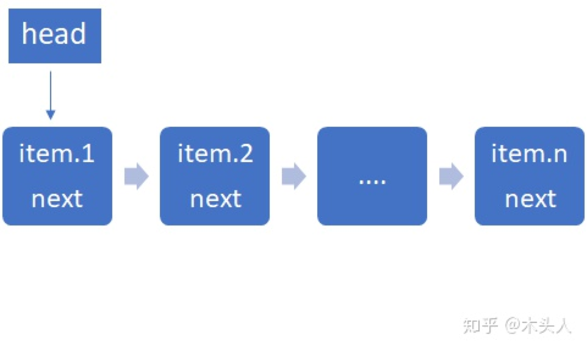

# 链表 (Liked list)
## 结构
链表是一种在存储单元上**非连续、非顺序**的存储结构。
数据元素的**逻辑顺序**是通过链表中的指针链接次序实现。

链表是由一系列的节点(Node)来实现的，通过每一个node存储下一个
node的指针来实现一种快速的插入。Node可以在运行时动态审生成，
每个Node包含两部分: 
- 数据域：存储数据元素
- 指针域：存储下一Node的指针

根据链表结构的不同，其种类可分为:
- 单向链表
- 单向循环链表
- 双向链表
- 双向循环链表

## 单向链表（Singly linked list）
单向链表也叫单链表，单向链表只可向一个方向遍历，它的每个Node包含两个域，如图：

*单链表*

*一个单向链表包含两个值: 当前节点的值和一个指向下一个节点的链接*

**head(表头)** 保存首地址，**item** 存储数据，**next** 指向下一Node地址。最后一个Node的链接(next)指向一个空值。

一般查找一个Node的时候需要从第一个Node开始每次访问下一个Node，一直访问到需要的位置。

链表失去了序列的随机读取优点，同时链表增加了指针域，空间开销也较大，但它对存储空间的使用要相对灵活。
例：

有一堆数据[1,2,3,5,6,7]，要在3和5之间插入4, 如果用数组，需要将5之后的数据都往后退一位，然后再插入4，这样非常麻烦，但是如果用链表，我就直接在3和5之间插入4就行。
<!-- [单链表](target "optional text") -->

## 双向链表（Doubly linked list）
它的每个Node中都有两个指针，分别指向直接后继和直接前驱。所以，从双向链表中的任意一个Node开始，都可以很方便地访问它的前驱Node和后继Node。一般我们都构造双向循环链表。

*一个双向链表有三个整数值: 数值, 向后的节点链接, 向前的节点链接*

有的时候第一个Node可能会被删除或者在之前添加一个新的Node。这时候就要修改指向首个Node的指针。有一种方便的可以消除这种特殊情况的方法是:

- 在最后一个Node之后、第一个Node之前储存一个**永远不会被删除或者移动**的虚拟Node，形成一个下面说的**循环链表**。
- 这个虚拟Node之后的Node就是真正的第一个Node。这种情况通常可以用这个虚拟Node直接表示这个链表。
- 对于把链表单独的存在数组里的情况，也可以直接用这个数组表示链表并用第0个或者第-1个（如果编译器支持）Node固定的表示这个虚拟节点。

## 参考文献
[维基百科_链表](https://zh.wikipedia.org/wiki/%E9%93%BE%E8%A1%A8)

[知乎文章_Python 数据结构之链表](https://zhuanlan.zhihu.com/p/60057180)

[知乎文章_通俗易懂讲解 链表](https://zhuanlan.zhihu.com/p/29627391)

